# 🚀 Mahavir Charity Management System

<p align="center">
  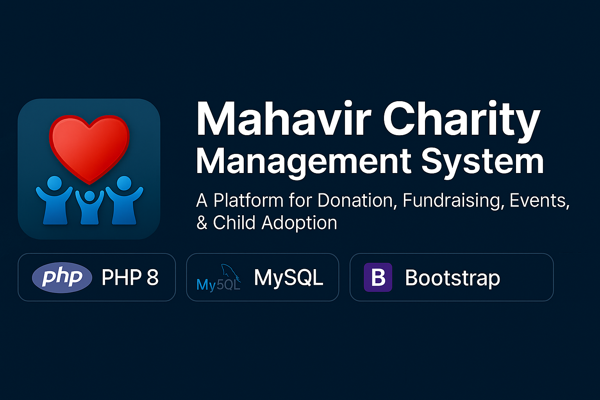
</p>

<p align="center">
  <b>A Modern Charity Management Platform built with PHP, MySQL & Bootstrap</b>
</p>

<p align="center">
  <a href="https://mahavir-charity.free.nf/" target="_blank"><b>🌐 Live Demo</b></a>
</p>

<p align="center">
  
  
  
  
  
</p>

---

## 🎮 Overview

**Mahavir Charity Management System** is a complete web-based solution designed to manage charity operations efficiently — including donations, fundraising campaigns, food donation workflows, child adoption processes, event galleries, appointments, and staff/donor administration.

Built using **PHP**, **MySQL**, and **Bootstrap**, the system is optimized for real-world deployment and role-based access control.

---

## ✨ Features

### 🎯 Core Modules
- ✔ Donor registration, login & donation history  
- ✔ Member & orphan management  
- ✔ Staff management with role-based access  
- ✔ Fundraising campaigns & fund collection tracking  
- ✔ Food donation management  
- ✔ Child adoption request handling  
- ✔ Appointment scheduling system  
- ✔ Event gallery & photo albums  

### 🎨 UI & UX
- Responsive Bootstrap design  
- Interactive carousels & galleries  
- DataTables for listings  
- Separate dashboards for Admin, Staff & Donor  

### 🔐 Security
- Role-based authentication (Admin / Staff / Donor)  
- Secure session handling  
- Safe form validation  

---

## 📸 Screenshots & Output Preview

### 🏠 Public Pages
<p align="center">
  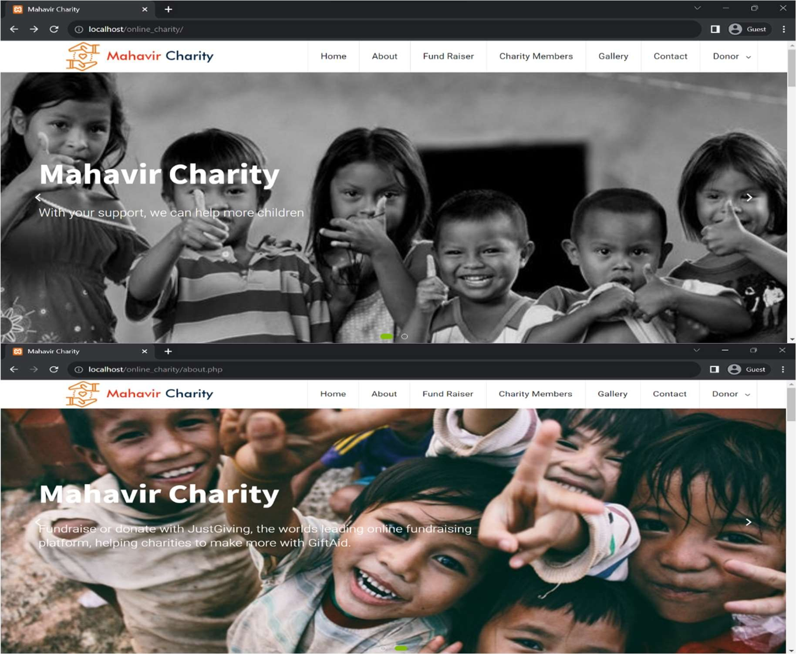
  
  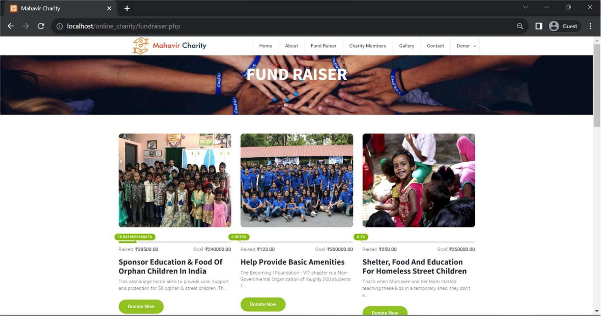
  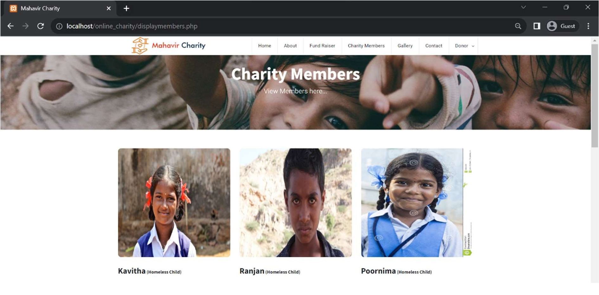
  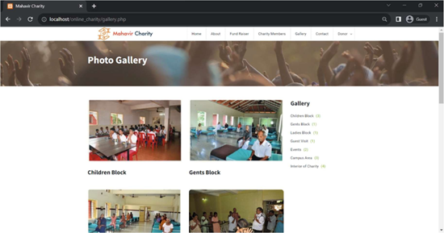
</p>

### 🔐 Donor & Staff Authentication
<p align="center">
  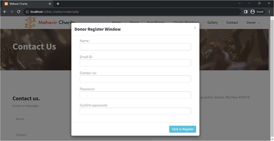
  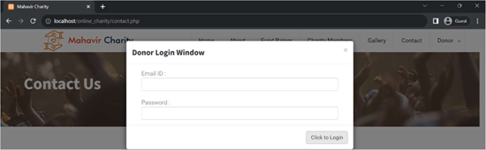
  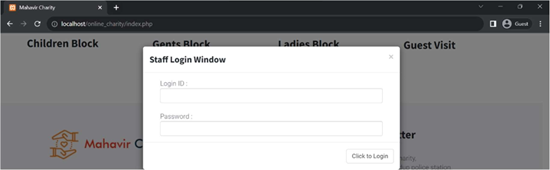
</p>

### 👨‍💼 Admin & Staff Dashboard
<p align="center">
  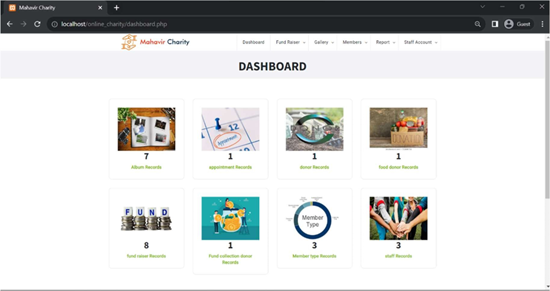
  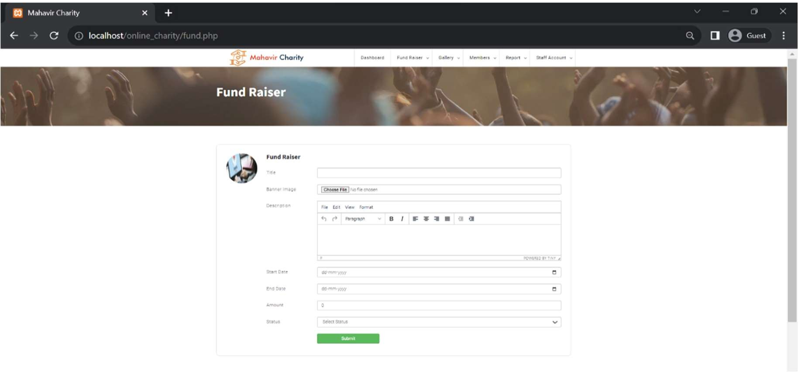
  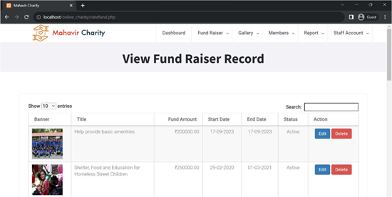
  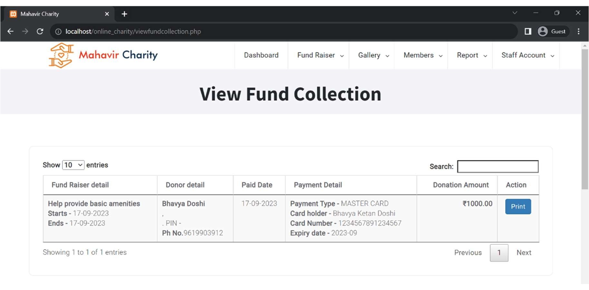
</p>

### 📷 Gallery & Albums
<p align="center">
  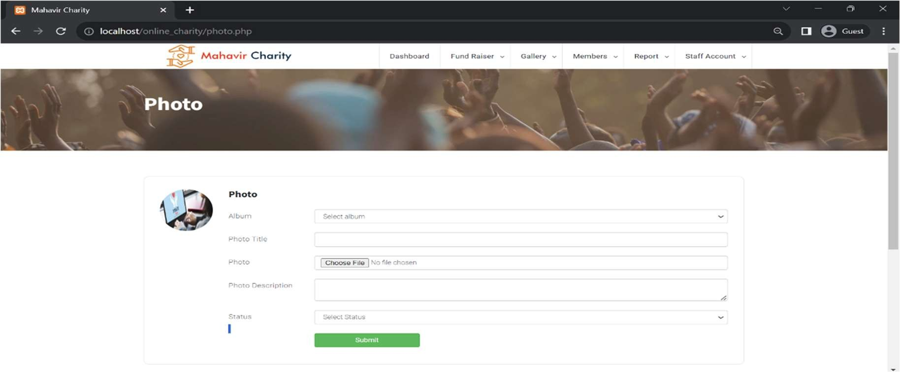
  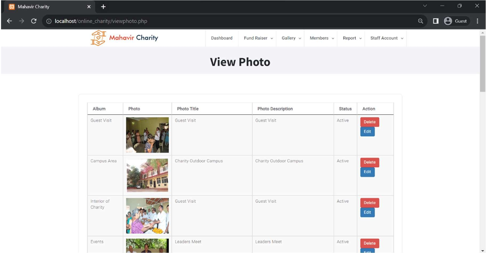
  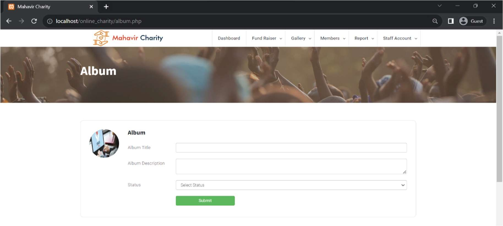
  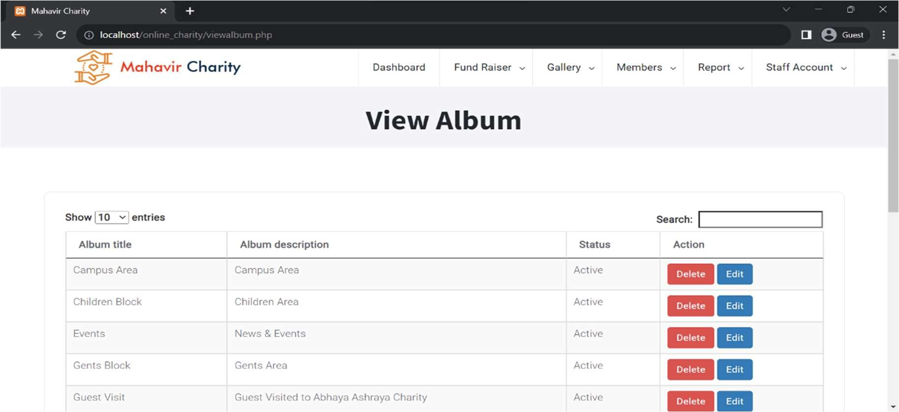
</p>

### 👶 Orphan, Donation & Staff Management
<p align="center">
  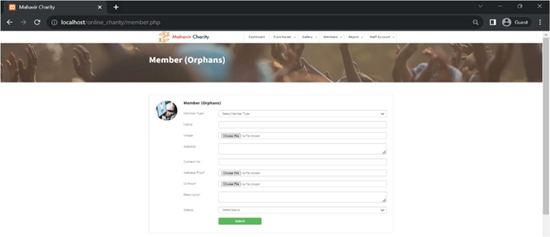
  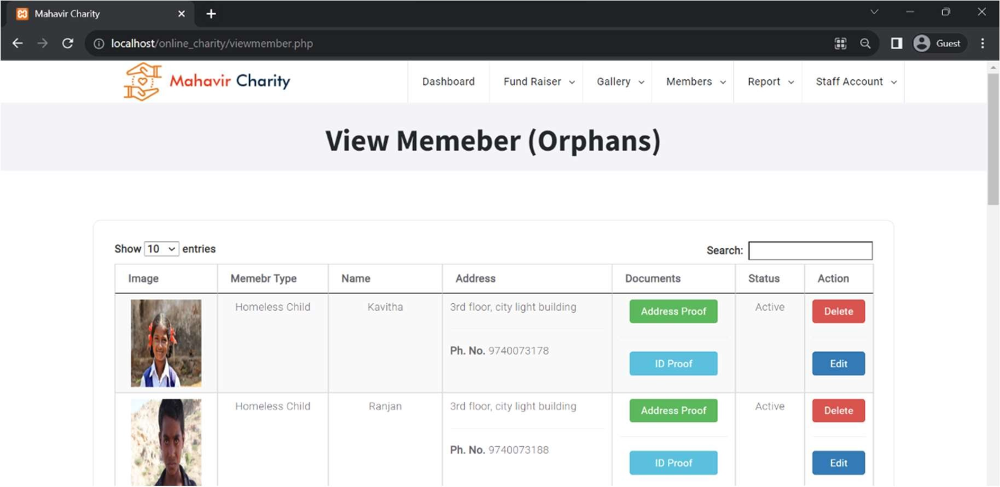
  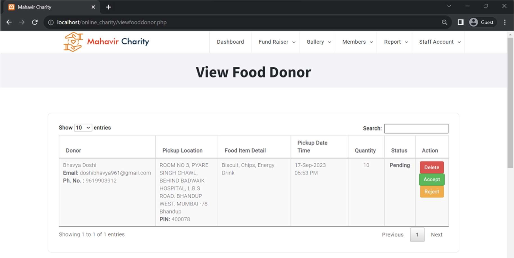
  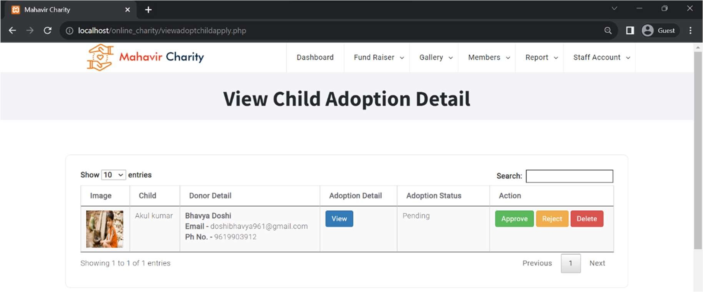
  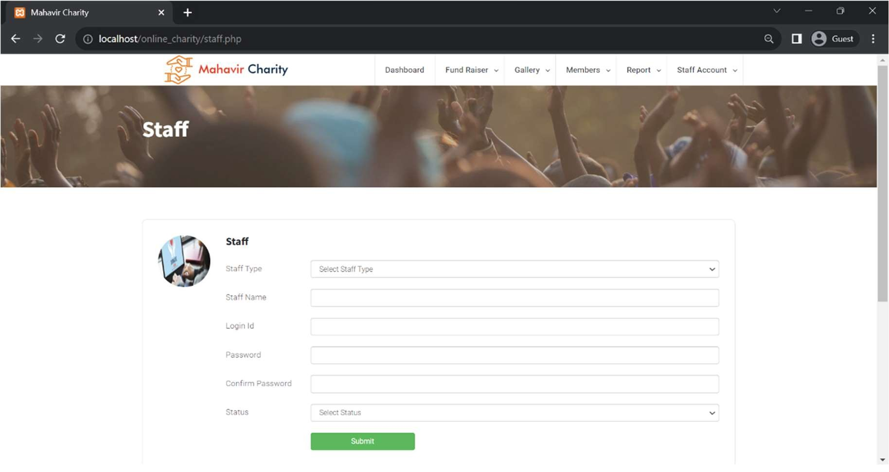
  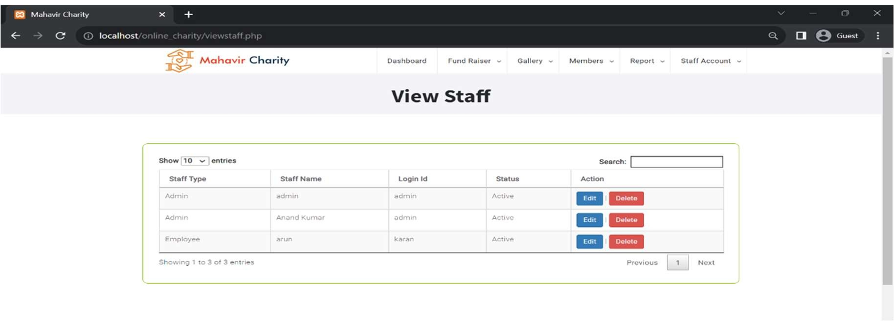
</p>

---

## 🛠 Technology Stack

| Layer | Technology |
|------|-----------|
| Backend | PHP 8.2.4 |
| Database | MySQL 10.4.28 |
| Frontend | HTML5, CSS3, JavaScript |
| UI Framework | Bootstrap 4.x |
| Server | Apache (XAMPP) |
| Hosting | InfinityFree |

---

## 🚀 Installation & Setup

### ✅ Prerequisites
- XAMPP / WAMP / LAMP  
- PHP 8.2+  
- MySQL  
- phpMyAdmin  

### 📥 Clone Repository
```bash
git clone https://github.com/your-repo/mahavir-charity.git
````

### 🗄 Database Setup

1. Open **phpMyAdmin**
2. Create database: `online_charity`
3. Import: `online_charity.sql`

### ⚙️ Database Configuration

```php
$con = mysqli_connect("localhost", "root", "", "online_charity");
```

---

## ▶️ Run the Project

* Start **Apache & MySQL**
* Visit:

```
http://localhost/mahavir_charity/
```

---

## 📁 Project Structure

```
mahavir_charity/
│── index.php
│── header.php
│── footer.php
│── databaseconnection.php
│── css/
│── js/
│── img/
│── online_charity.sql
│── README.md
```

---

## 🔐 User Roles

### 👤 Donor

* Register & login
* Donate & track history

### 👨‍💼 Staff

* Manage members & donors
* Upload gallery photos

### 👑 Admin

* Full system control
* Staff & module management

---

## 📝 Notes

* 🔒 Never commit database credentials publicly
* 📱 Fully responsive design
* 🎯 Ideal for academic & portfolio use

---

## 🤝 Contributing

Fork → Improve → Pull Request
Contributions are welcome!

---

## 📄 License

Licensed under the **MIT License**

---


<p align="center">
  ❤️ <b>Made with love for Mahavir Charity</b><br/>
  ✨ Helping people. Changing lives.
</p>
